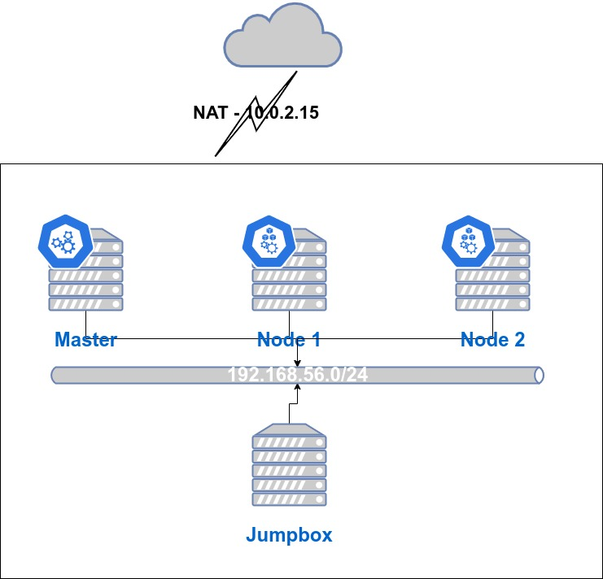

# Virtualbox Cluster
This will create 4 Ubuntu 20.04 LTS servers. The server roles are marked by their name:  
* **Jumpbox** - A server that you can use to connect to the other servers in the cluster. Note that if you do not have enough resources to run 4 VM servers, you can skip the creation of this server.
* **Master** - This has more RAM and CPU than the other servers and will serve as our Control Plane server.
* **Node1/Node2** - This will be your 2 worker nodes.  

Note that these servers will be bare installations and will serve as the base to practice the installation of a non-HA Kubernetes cluster.  

# Diagram  
Each server will have 2 network interface cards. The first one is the default NAT network card that VirtualBox assigns. All the servers will have the same IP address for this interface (10.0.2.15/24) This will be the interface where all internet bound communication will go through.  

Each server will have a secondary network card assigned to a local VirtualBox network. The default local network has the CIDR block 192.168.56.0/24 assigned to it. This is where our inter-cluster communication will take place. As such be aware that during 'kubeadm init', you will need to use the '--apiserver-advertise-address' parameter along with the IP address of your Master node to ensure that Kubernetes does not look for traffic in the NAT interface.  


# Requirements and usage
You will need to have Vagrant installed to spin this up. On this folder run:  
```
$ vagrant up
```
If you wish to pause the VM you can run:
```
$ vagrant suspend
```
If you want to delete the VM you can run:
```
$ vagrant destroy
```
To ssh into a box:  
```
$ vagrant ssh <name>

e.g.
$ vagrant ssh jumpbox
```
Once inside a box, you can ssh into other boxes by running this command:  
```
vagrant@jumpbox $ ssh vagrant@<name>.local

e.g.
vagrant@jumpbox $ ssh vagrant@master.local
```
The vagrant user password is also set to vagrant.